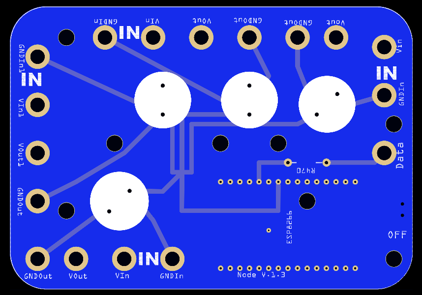
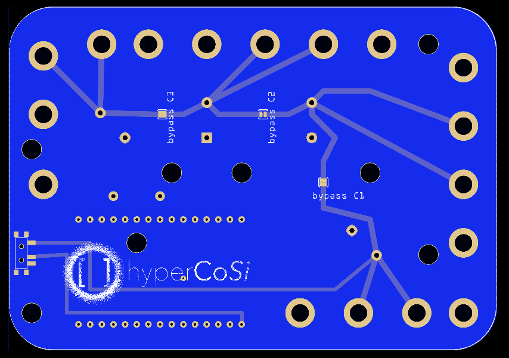
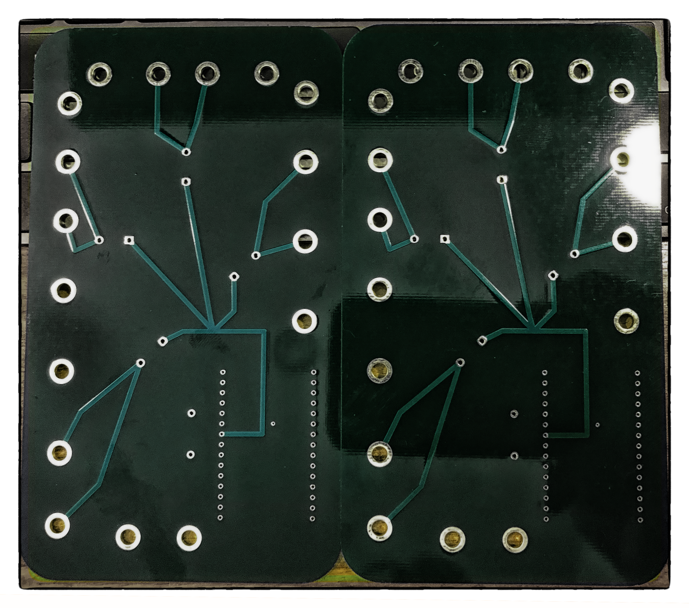
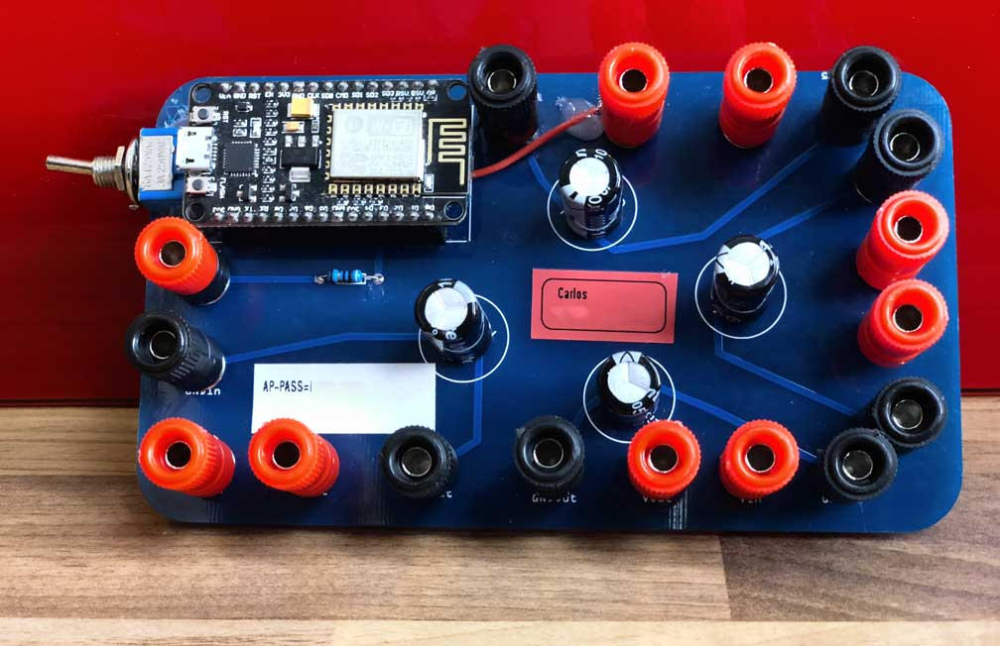
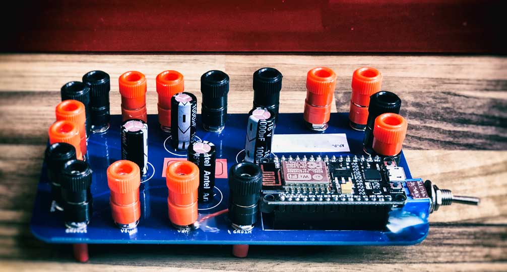
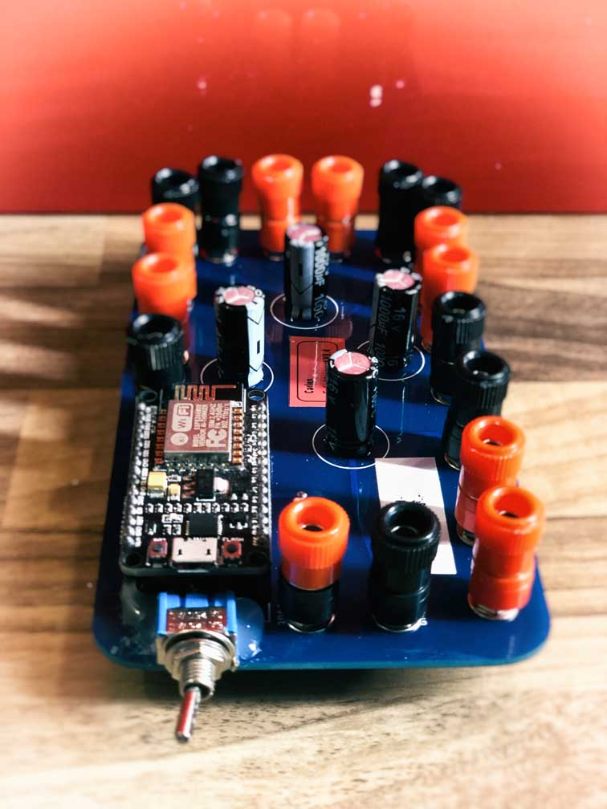

# Hyperion via UDP to ESP8266

## Flash Arduino
File for Arduino IDE located in `WLED`

## Setup Hyperion on PI
The `hyperion.config.json` file in this folder is setup for a 64 LED Background with no bottom.

So go get HyperCon.jar and generate a led setup what matches your setup, ignore everything else. You just need the led setup and generate a config with it. Now mark everything from 
`"leds" :`
until
`],`
and copy it. 

Go to the hyperion.config.json in this folder and replace the lines 99 - 426 with the just copied content.

Et voila, you are ready to go.
Put the file on your pi in `/storage/.config/`

## PCB & Breadboard

I created a pcb for the ESP8266 Dev Board called NodeMCU 0.9. It's a setup with 4 Power Injectors, +/- each protected by a 1000 µF capacitor leading to 4 Power Outs +/- and one Dataline connected to the D4 Port of the NodeMCU and protected with a 470Ω Resistor.

If you need to build your hardware, go to layout, there you can find:

 * Fritzing file `tvbacklightesp8266_v1.2.fzz` 

 * Gerber to get my PCB Layout manufactured

### v1.0
  * Full working layout

### v1.1
  * added Switch to power the NodeMcu with the 5V Power from the injectors

### v1.2
  * added multiple Jumper to that can be used instead of up to 3 capacitors. That enables one powerinput with all 4 power outputs for every edge of the screen.

### v1.3
  * added mountingholes
  * redesigned for a smaller form factor
  * add solderjumper

### Rendered from Gerber
 

 
### Real PCBs
 

 #### Completed boards
 
 
 

### Parts list v1.2
  * 1-4 x1000 µF capacitor
  * 0-3 Jumper
  * ESP8266 Node MCU
  * 1 Switch
  * 470Ω Resistor 
  * Receptacle socket for the Nodemcu

