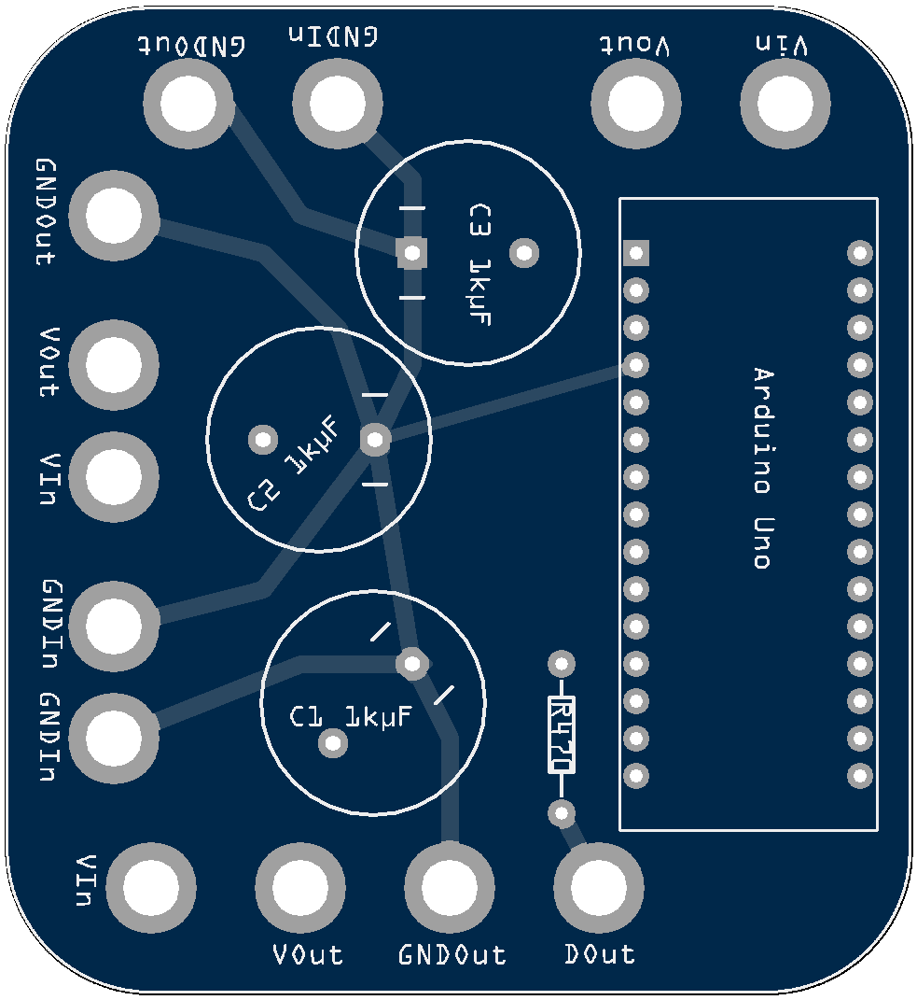

# Hyperion via USB direct to Arduino Nano

## Flash Arduino
File for Arduino IDE located in `hyperion_ws2812`

## Setup Hyperion on PI
The `hyperion.config.json` file in `F128_Config` is setup for a 128 LED Background with no bottom.

So go get HyperCon.jar and generate a led setup what matches your setup, ignore everything else. You just need the led setup and generate a config with it. Now mark everything from 
`"leds" :`
until
`],`
and copy it. 

Go to the hyperion.config.json in F128_Config and replace the lines 96 - 743 with the just copied content.

Et voila, you are ready to go.
Put the file on your pi in `/storage/.config/`

 
## PCB & Breadboard

I created a pcb for the Arduino Nano setup with 3 Power Injectors, +/- each protected by a 1000 µF capacitor leading to 3 Power Outs +/- and one Dataline connected to the D11 Port of the Nano and protected with a 470Ω Resistor.

If you need to build your hardware, go to layout, there you can find:

 * Fritzing file `tvbacklightnano.fzz`
 * Gerber to get my PCB Layout manufactured
 

---------------------------------------
### Rendered from Gerber
 

---------------------------------------
### Real PCBs

---------------------------------------
### Complete assebled Board

---------------------------------------
### Parts list
  * 3 x1000 µF capacitor
  * Arduino Nano
  * 470Ω Resistor 
  * Receptacle socket for the nano

