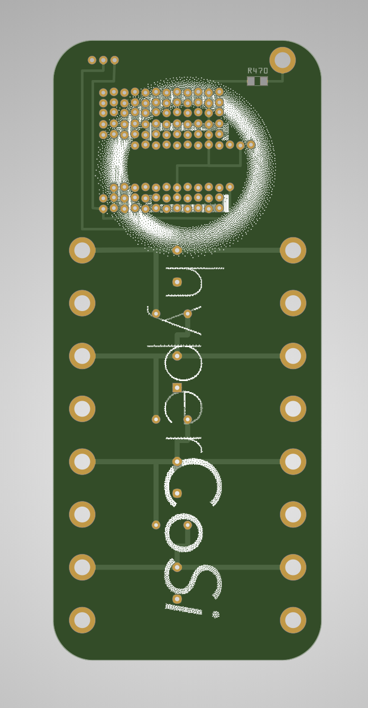
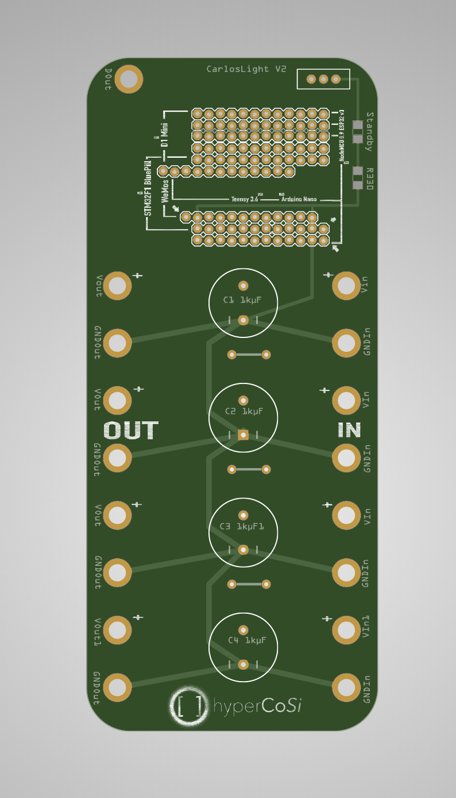
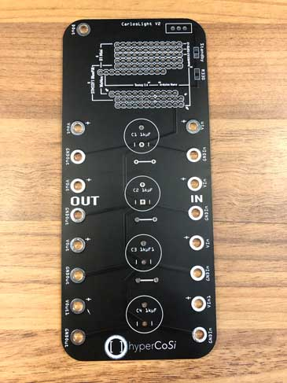
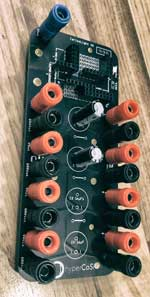

# Hyperion via USB/UDP to ANY

## Flash Arduino
not specified

## Setup Hyperion on PI
not specified

## PCB & Breadboard

I created a universal pcb. It's a setup with 4 Power Injectors, +/- each protected by a 1000 µF capacitor leading to 4 Power Outs +/- and one Dataline connected with a 470Ω Resistor. All Caps can be bypassed by jumpers so that less than 4 power inputs can be driven too. The controller can run selfpowered. An LED indicates standby and a switch turns it off/on. 

If you need to build your hardware, go to layout, there you can find:

 * Fritzing file `tvbacklight_v2.02.fzz` 

 * Gerber to get my PCB Layout manufactured

### v2.0(.1)
  * Full working layout

### v2.0.1
  * added mounting holes

### Rendered from Gerber
 

 
### Real PCBs
 

 #### Completed boards
 
 
### Parts list v2.0.1
  * 1-4 x1000 µF capacitor
  * 0-3 Jumper
  * 1 Switch
  * SMD 470Ω Resistor (471)
  * SMD 330Ω Resistor (331)
  * Receptacle socket for the descired controller

